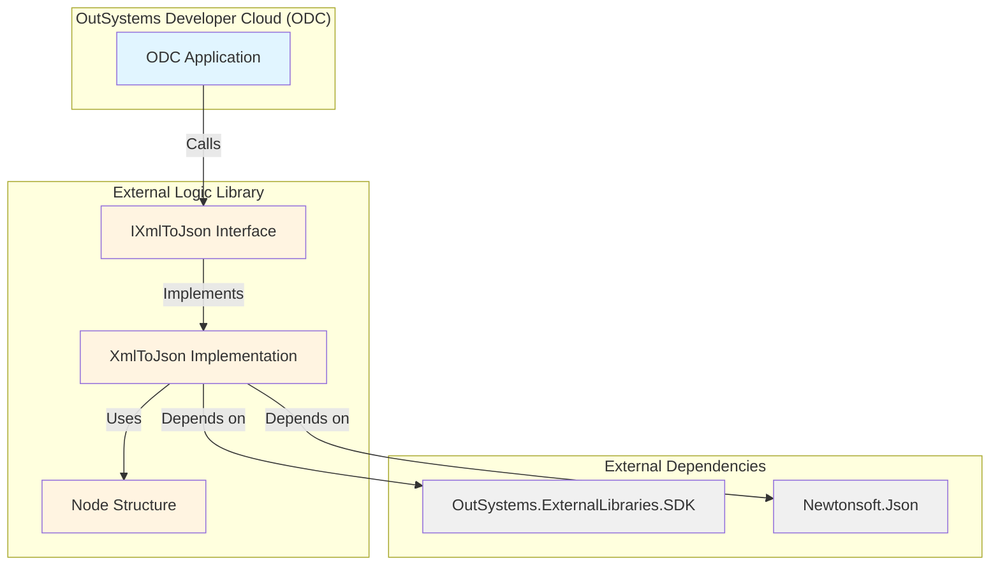
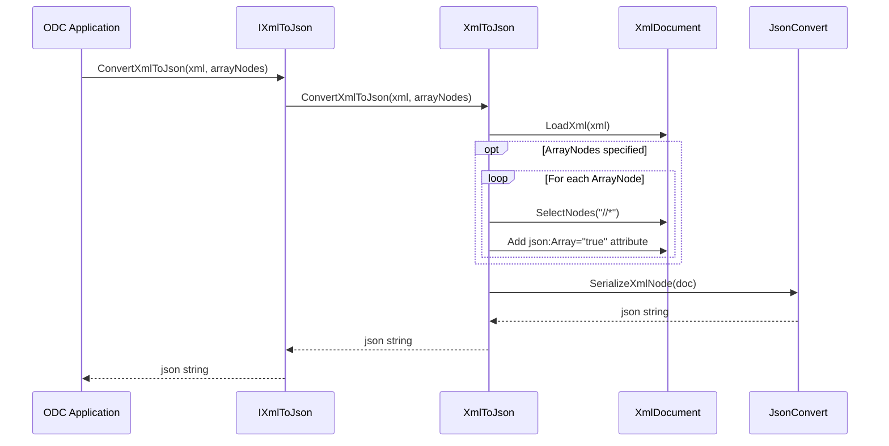

# Architecture

## Overview

`vanguard-xml-to-json` is an OutSystems Developer Cloud (ODC) External Logic Library that converts XML documents to their JSON equivalents. This is a port of the OutSystems 11 [XmlToJson Forge component](https://www.outsystems.com/forge/component-overview/3709/xmltojson-o11) to the ODC platform.

The library is built on .NET 8.0 and leverages Newtonsoft.Json for the core XML-to-JSON transformation logic.

## System Boundary

## Components

### Core Components

#### IXmlToJson Interface
**File:** `XmlToJson/IXmlToJson.cs`

The public contract exposed to ODC applications. Decorated with OutSystems SDK attributes to define the external library metadata:
- `[OSInterface]` - Defines the library name, description, and icon
- `[OSAction]` - Exposes the `ConvertXmlToJson` method to ODC

#### XmlToJson Implementation
**File:** `XmlToJson/XmlToJson.cs`

The core implementation that performs the XML-to-JSON conversion:
1. Parses the input XML string into an `XmlDocument`
2. Optionally processes `ArrayNodes` parameter to mark specific nodes for array treatment
3. Delegates to `JsonConvert.SerializeXmlNode()` from Newtonsoft.Json
4. Returns the resulting JSON string

#### Node Structure
**File:** `XmlToJson/Node.cs`

A simple data structure representing XML node names that should be treated as arrays in the JSON output, even when they contain a single element. This addresses the common XML-to-JSON conversion challenge where single elements are converted to objects, but multiple elements become arrays.

### Supporting Components

#### Project Configuration
**File:** `XmlToJson/XmlToJson.csproj`

.NET 8.0 project configuration with:
- Target framework: `net8.0`
- NuGet dependencies: `Newtonsoft.Json` (13.0.3), `OutSystems.ExternalLibraries.SDK` (1.5.0)
- Embedded icon resource for ODC UI

#### Packaging Script
**File:** `XmlToJson/generate_upload_package.ps1`

PowerShell automation script that:
1. Publishes the project for `linux-x64` runtime
2. Packages the output into `ExternalLibrary.zip` for ODC deployment

## Data Flow

## External Dependencies

### Newtonsoft.Json (13.0.3)
The industry-standard JSON library for .NET. Used specifically for its `JsonConvert.SerializeXmlNode()` method, which handles the core XML-to-JSON transformation logic including:
- XML namespace handling
- Attribute conversion (prefixed with "@")
- Array detection via `json:Array` attribute

**Limitations:** Any conversion constraints in this library directly affect the output of this component.

### OutSystems.ExternalLibraries.SDK (1.5.0)
The OutSystems SDK that enables .NET libraries to be consumed as External Logic in ODC. Provides:
- Metadata attributes (`[OSInterface]`, `[OSAction]`, `[OSStructure]`)
- Data type mappings (`OSDataType.Text`)
- Parameter decorators (`[OSParameter]`)

## Deployment Model

The library is deployed as an External Logic package to OutSystems Developer Cloud:

1. **Build**: `dotnet publish -c Release -r linux-x64 --self-contained false`
2. **Package**: Compress published output into `ExternalLibrary.zip`
3. **Upload**: Deploy via ODC Portal as an External Logic library
4. **Consume**: Reference in ODC applications and call `ConvertXmlToJson` action

**Runtime Environment:** Linux x64 (ODC standard runtime)

## Architectural Tenets

### 1. Simplicity First
The library maintains a focused, single-responsibility design: convert XML to JSON. No additional processing, validation, or transformation is performed beyond this core function.

### 2. Leverage Battle-Tested Libraries
Rather than implementing custom XML-to-JSON conversion logic, the library delegates to Newtonsoft.Json's proven implementation, reducing maintenance burden and potential bugs.

### 3. OutSystems Integration by Design
All public APIs are explicitly designed for OutSystems consumption using SDK attributes, ensuring seamless integration with the ODC platform's type system and UI.

### 4. Explicit Array Control
The `ArrayNodes` parameter provides developers with fine-grained control over array conversion, addressing the inherent ambiguity in XML-to-JSON transformation where single-element collections are indistinguishable from scalar values.

### 5. Namespace Agnostic
The implementation uses `LocalName` for node matching, allowing the library to work with XML documents regardless of their namespace declarations.

## Design Decisions

### Why Not XmlDocument Instead of XDocument?
The implementation uses `XmlDocument` (DOM-based) rather than `XDocument` (LINQ-based) because Newtonsoft.Json's `SerializeXmlNode()` method requires an `XmlDocument` instance. This is a constraint imposed by the external dependency.

### Why Manual Node Iteration?
The code comment in `XmlToJson.cs:27-28` explains: "it may be possible to be a better select than fetch all, but I couldn't get it to work with random namespaces." The implementation selects all nodes (`//*`) and filters by `LocalName` to ensure compatibility with arbitrary namespace prefixes.

### Why json:Array Attribute?
Newtonsoft.Json recognizes the special attribute `json:Array="true"` in the `http://james.newtonking.com/projects/json` namespace. Adding this attribute to XML nodes before serialization forces those nodes to be rendered as arrays in the JSON output, even if they contain only a single element.

## Security Considerations

### XML Parsing Risks
The library uses `XmlDocument.LoadXml()` which is vulnerable to:
- **XML bombs (billion laughs attack)**: Maliciously crafted XML with exponential entity expansion
- **XXE (XML External Entity) attacks**: If DTD processing is enabled (default in .NET may vary)

**Mitigation:** Consumers should validate and sanitize XML input before passing to this library. Consider implementing input size limits and disabling DTD processing in production environments.

### Dependency Chain
The library's security posture depends on:
- Newtonsoft.Json (13.0.3) - ensure timely updates for security patches
- OutSystems.ExternalLibraries.SDK (1.5.0) - managed by OutSystems

Regularly review NuGet package advisories and update dependencies.

## Performance Characteristics

- **Time Complexity**: O(n) where n is the number of nodes in the XML document
- **Space Complexity**: O(n) for the in-memory `XmlDocument` representation
- **Bottleneck**: The `SelectNodes("//*")` call when `ArrayNodes` is specified iterates over all nodes multiple times (once per array node name)

**Optimization Opportunity**: For large XML documents with many `ArrayNodes`, consider building a single pass that checks all node names simultaneously rather than multiple passes.

## Future Considerations

### Testing
Currently, the repository lacks automated tests. Consider adding:
- Unit tests for various XML structures (namespaces, attributes, nested elements)
- Edge case tests (empty XML, malformed XML, special characters)
- Performance tests for large XML documents

### Configuration Options
Potential enhancements:
- Control over attribute prefix (currently hardcoded "@")
- Option to omit XML declarations
- Custom namespace handling behavior

### .NET Version Support
The library targets .NET 8.0. Monitor OutSystems ODC runtime updates to ensure alignment with supported .NET versions.
